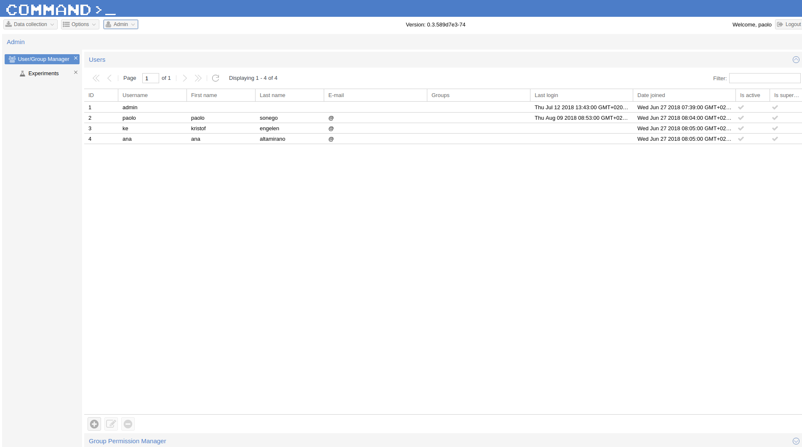
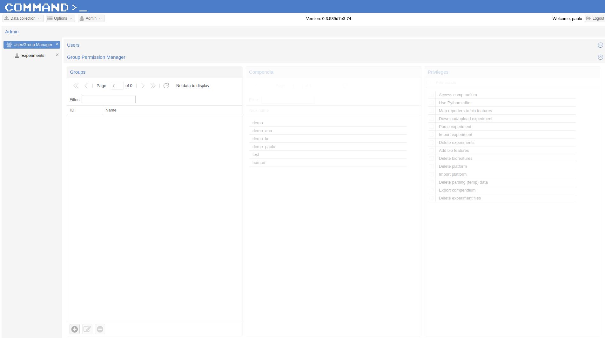
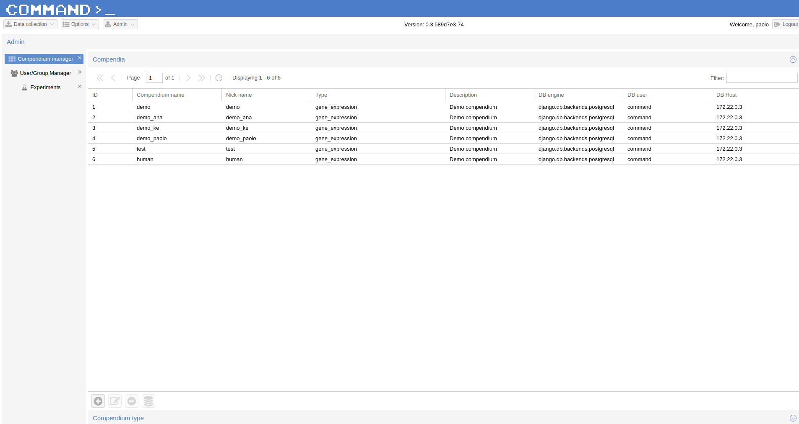
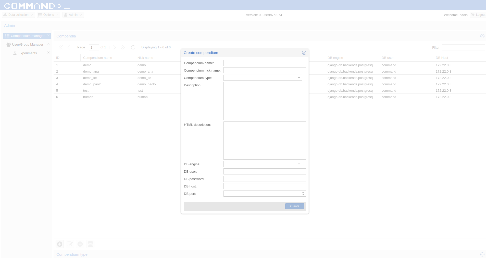

Admin
=====

The admin interface is visible only to admin users that have complete access to COMMAND>_ functionalities
and compendia.

Users/Group manager
-------------------

   User manager page

The user menu allow to create, remove and modify users. Moreover, an admin user can assign users to groups
and set privileges to them. Group privileges are compendium-specific, i.e. we can for example restrict
access only to some compendia and avoid users belonging to a group to see the others. For those compendia
we can limit some functionalities, for example we could avoid users to run Python script or import experiments.

   Permission manager page

Compendium manager
------------------

   Compendium manager page

From this page a compendium can be created, modified, deleted and initialized. From a technical point of view
a *compendium* is nothing more than a database schema. When an admin user creates a new compendium he will be asked
to add all the information necessary to connect to such database.

   New compendium page

Once the connection information are saved and a new *compendium* appear in the grid, it would be possible to
*initialize* it, i.e. to create the database schema.

.. note::
   In this way it is possible to have compendia hosted on different database server. If the database
   do not exists yet it will be possible to have COMMAND>_ to create it on the fly but you will be
   asked to provide *username* and *password* for a **database admin user**.
   Default database admin user is *postgres* with password *postgres*.

The *Compendium Type* section is read-only and at the moment is filled only with *gene expression* since
it is the only type of compendium you are allowed to create. To extend COMMAND>_ and allow other kind
of quantitative data to be collected please have a look at :doc:`for_developers`.
