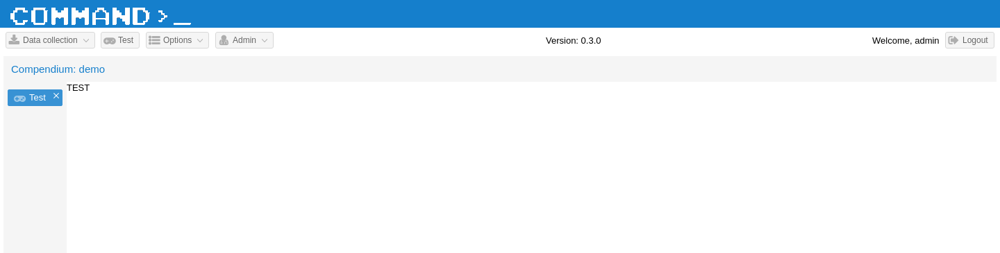
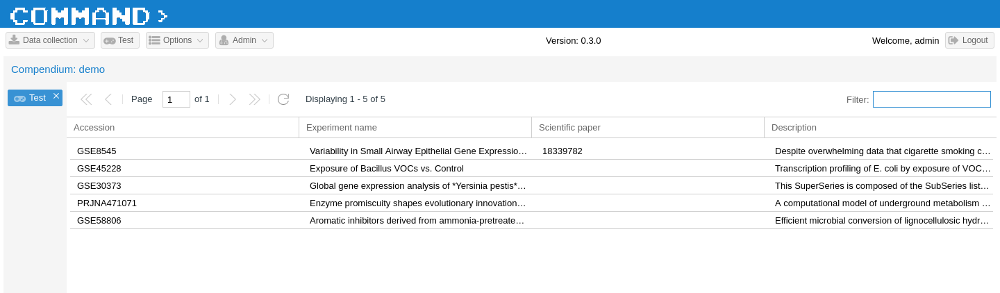
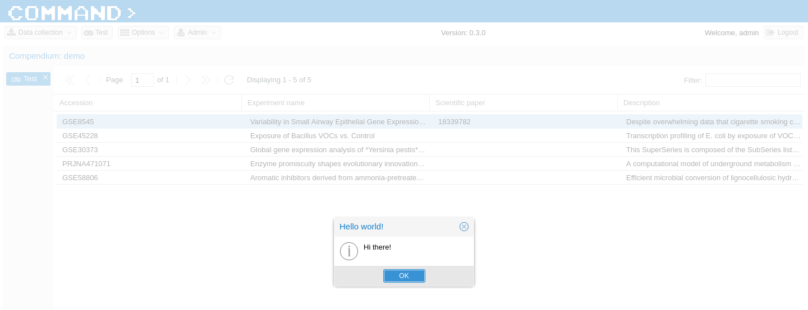
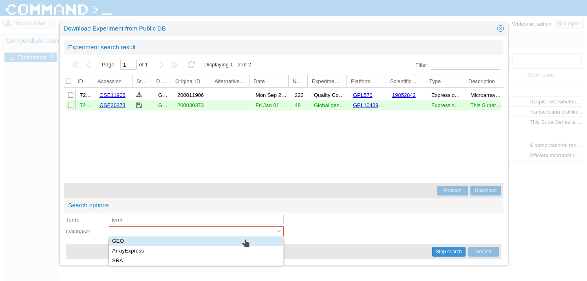
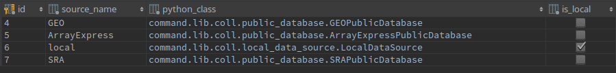

.. _for-developers-label:
COMMAND>_ for developers
========================

In order to add new features to COMMAND>_ you'll need to stick with the whole framework. As a demonstration we will create a basic page to retrieve some data from the database and show them in a grid within COMMAND>_.
So we will take care of:

 * create the ExtJS interface;
 * create the Python view;
 * create the permission to access the view;
 * make an AJAX call passing parameters;
 * perform a job on celery to run in background;
 * handle websocket to show the results on a grid;

We will also see how to extend COMMAND>_ functionalities such as how to add a new public database users can use to perform search on, how to add a new platform type and so on.

.. Note::

  For anything else related to the interface design please refer to the `ExtJS documentation <https://docs.sencha.com/extjs/6.2.0/>`_. While to properly add new models and extend the Data Model, please refer to the `Django documentation <https://docs.djangoproject.com/en/1.11/>`_

Add brand new feature in COMMAND>_
----------------------------------

Create the ExtJS interface
++++++++++++++++++++++++++
COMMAND>_ is a single-page application, so everything you see runs within one `HTML file <https://github.com/marcomoretto/command/blob/master/templates/command/index.html>`_ and the Javascript code needed to display the interface is loaded and managed by the ExtJS framework.
All ExtJS interface files (views) live within the directory ``command/static/command/js/ext-js/app/view``. So let's create a ``test`` directory in here and, within that directory let's create 2 files: ``Test.js`` and ``TestController.js``.

Let's fill these two files with some basic code like the following:

.. code-block:: javascript

  // Test.js

  Ext.define('command.view.test.Test', {
    extend: 'Ext.Component',

    xtype: 'test',

    title: 'Test',

    requires: [
        'Ext.panel.Panel',
        'command.view.test.TestController'
    ],

    controller: 'test',

    store: null,

    alias: 'widget.test',

    itemId: 'test',

    reference: 'test',

    viewModel: {},

    html: 'TEST',

    listeners: {
        //
    },

    initComponent: function() {
        this.callParent();
    },

    destroy: function() {
        this.callParent();
    }
  });

.. code-block:: javascript

  // TestController.js

  Ext.define('command.view.test.TestController', {
    extend: 'Ext.app.ViewController',

    alias: 'controller.test'
  });

Now you will need to run the command ``sencha app build`` from within the ``command/static/command/js/ext-js`` directory.

.. Note::

  To use the ``sencha app build`` command you will need to download and install `Sencha CMD <https://docs.sencha.com/cmd/>`_

Now you should be able to point your browser to http://localhost/#view/test and see that the ``Test`` panel has been correctly loaded as a tab within the main application panel. To make it reachable with a button and to add a small icon next to the tab name we should edit two files, ``Main.js`` (`here <https://github.com/marcomoretto/command/blob/master/static/command/js/ext-js/app/view/main/Main.js>`_) and ``Application.js`` (`here <https://github.com/marcomoretto/command/blob/master/static/command/js/ext-js/app/Application.js>`_).

.. code-block:: javascript
    :lineno-start: 100

    // Main.js
    // Add the ``Test`` menu button

    },{
        text: 'Test',
        itemId: 'test_menu_item',
        iconCls: null,
        glyph: 'xf11b',
        listeners: {
            click: {
                fn: 'onAction',
                hash: 'view/test',
                glyph: 'xf11b',
                panel: 'test'
            }
        }
    },{
        text: 'Options',
        ...

.. code-block:: javascript
    :lineno-start: 34

    // Application.js
    // Add the ``test`` glyph

    version: null,

    panel_glyph: {
        'test': 'xf11b',
        ...

You should see something like the following:

.. screenshot_test:

Create the Python View code
+++++++++++++++++++++++++++

Now let's create a grid, a basic double-click event and a link to a Python view. First of all we need to create the ``test.py`` file within the ``views`` directory (`here <https://github.com/marcomoretto/command/tree/master/command/lib/views>`_). The basic view file should look something like that:

.. code-block:: python

    // test.py

    import json
    from django.http import HttpResponse
    from django.views import View
    from command.lib.utils.decorators import forward_exception_to_http

   class TestView(View):

      def get(self, request, operation, *args, **kwargs):
         method = getattr(self, operation)
         return method(request, *args, **kwargs)

      def post(self, request, operation, *args, **kwargs):
         method = getattr(self, operation)
         return method(request, *args, **kwargs)

      @staticmethod
      @forward_exception_to_http
      def test(request, *args, **kwargs):

        return HttpResponse(json.dumps({'success': True}),
                            content_type="application/json")

The ``test`` function does nothing at the moment and is meant to respond to an Ajax call. We'll see that within the same ``TestView`` class we will put both code to manage Ajax and WebSocket requests. Before we add any business logic code we need to tell COMMAND>_ that the ExtJS view ``test`` will make requests to the Python view ``TestView`` and that users need no specific privileges to do that (for the moment). So let's add one line in the ``consumer.py`` script (`here <https://github.com/marcomoretto/command/blob/master/command/consumers.py>`_):

.. code-block:: python
   :lineno-start: 34

   # consumer.py

   class Dispatcher:
      dispatcher = {
         ...
         ExportDataView: ['export_data'],
         TestView: ['test']
      }

Add a grid to the ExtJS interface
+++++++++++++++++++++++++++++++++

So far, so good. Let's remove the HTML code from the ``Test.js`` file and let's add a grid to show all the experiments for the selected compendium. The file will now look like this:

.. code-block:: javascript
   :lineno-start: 1

   // Test.js

   Ext.define('command.view.test.Test', {
      extend: 'command.Grid',

      xtype: 'test',

      title: 'Test',

      requires: [
        'Ext.panel.Panel',
        'command.view.test.TestController'
      ],

      controller: 'test',

      store: null,

      alias: 'widget.test',

      itemId: 'test',

      reference: 'test',

      viewModel: {},

      mixins: {
         getRequestObject: 'RequestMixin'
      },

      command_view: 'test',

      command_read_operation: 'test_read',

      listeners: {
        //
      },

      columns: [{
        text: 'Accession',
        flex: 2,
        sortable: true,
        dataIndex: 'experiment_access_id',
      }, {
        text: 'Experiment name',
        flex: 2,
        sortable: true,
        tdCls: 'command_tooltip',
        dataIndex: 'experiment_name'
      }, {
        text: 'Scientific paper',
        flex: 2,
        sortable: true,
        dataIndex: 'scientific_paper_ref'
      }, {
        text: 'Description',
        flex: 2,
        sortable: true,
        tdCls: 'command_tooltip',
        dataIndex: 'description'
      }],

      initComponent: function() {
        this.store = Ext.create('command.store.Experiments');
        this.callParent();
      },

      destroy: function() {
        this.callParent();
      }
   });

Please note that:

 * at line ``4`` we extend ``command.Grid``;
 * at line ``31`` we are saying to COMMAND>_ the view to be used;
 * at line ``33`` we are declaring the default read operation (i.e. the default Python function to be called);
 * at line ``64`` we are declaring the ExtJS store to use.

Link the ExtJS grid to the Python code via WebSocket
++++++++++++++++++++++++++++++++++++++++++++++++++++

The ``test.py`` Python view file will have a ``test_read`` function that will look like the following:

.. code-block:: python

   # test.py

   @staticmethod
   @forward_exception_to_channel
   def test_read(channel_name, view, request, user):
      channel = Channel(channel_name)

      start = 0
      end = None
      compendium = CompendiumDatabase.objects.get(id=request['compendium_id'])
      if request['page_size']:
         start = (request['page'] - 1) * request['page_size']
         end = start + request['page_size']
      order = ''
      if request['ordering'] == 'DESC':
         order = '-'

      query_response = Experiment.objects.using(compendium.compendium_nick_name). \
         filter(Q(experiment_access_id__icontains=request['filter']) |
                Q(scientific_paper_ref__icontains=request['filter']) |
                Q(description__icontains=request['filter']) |
                Q(experiment_name__icontains=request['filter']))
      try:
         query_response = query_response.order_by(order + request['ordering_value'])
      except Exception as e:
         pass

      total = query_response.count()
      query_response = query_response[start:end]

      channel.send({
         'text': json.dumps({
             'stream': view,
             'payload': {
                 'request': request,
                 'data': {
                     'experiments': [exp.to_dict() for exp in query_response],
                     'total': total
                 }
             }
         })
      })

If you refresh your browser, you should now see something like the following:

.. screenshot_test_2:

As final step in this brief tutorial, let's add a double-click event on the grid to call the ``test`` function defined in the ``TestView`` Python view to run an empty job on the Celery task manager. When the job is done we'll have a callback function to show a message back on the interface. First thing is to add the event listener.

Create the Ajax call on double-click event
++++++++++++++++++++++++++++++++++++++++++

.. code-block:: javascript

   // Test.js

   listeners: {
      itemdblclick: 'onTestDoubleClick'
   },

Then we'll need to implement the ``onTestDoubleClick`` in the ``TestController.js``

.. code-block:: javascript

   // TestController.js

   onTestDoubleClick: function(dv, record, item, index, e) {
        var grid = dv.up('grid');
        var gridSelection = grid.getSelection();
        var request = grid.getRequestObject('test');
        request.values = JSON.stringify(gridSelection[0].data);
        Ext.Ajax.request({
            url: request.view + '/' + request.operation,
            params: request,
            success: function (response) {
                command.current.checkHttpResponse(response);
            },
            failure: function (response) {
                console.log('Server error', reponse);
            }
        });
    }

Manage asynchronous code using Celery and WebSocket
+++++++++++++++++++++++++++++++++++++++++++++++++++

The ``request`` object is configured to automatically retrieve the view name (``request.view``) and setted to call the ``test`` function in the Python ``TestView``.

.. code-block:: python

   # test.py

    @staticmethod
    @forward_exception_to_http
    def test(request, *args, **kwargs):
        values = json.loads(request.POST['values'])

        comp_id = request.POST['compendium_id']
        channel_name = request.session['channel_name']
        view = request.POST['view']
        operation = request.POST['operation']

        test.test_task.apply_async(
            (request.user.id, comp_id, values['id'], channel_name, view, operation)
        )

        return HttpResponse(json.dumps({'success': True}),
                            content_type="application/json")

With the ``test.test_task.apply_async`` we are calling the ``test_task`` function from the Celery task file ``test.py`` (not to be confused with the Python view file that have the same name). We need to create this file and implement the functionality. So let's create a file name ``test.py`` in the ``command/command/lib/task`` directory (`here <https://github.com/marcomoretto/command/tree/master/command/lib/tasks>`_). The file will look like that:

.. code-block:: python

   # test.py

   from __future__ import absolute_import, unicode_literals
   from time import sleep
   import celery
   from channels import Channel
   from command.lib.utils.message import Message

   class TestCallbackTask(celery.Task):
       def on_success(self, retval, task_id, args, kwargs):
           user_id, compendium_id, path, channel_name, view, operation = args
           channel = Channel(channel_name)
           message = Message(type='info', title='Hello world!',
                             message='Hi there!'
                             )
           message.send_to(channel)

       def on_failure(self, exc, task_id, args, kwargs, einfo):
           pass

   @celery.task(base=TestCallbackTask, bind=True)
   def test_task(self, user_id, compendium_id, exp_id, channel_name, view, operation):
       sleep(1)

The ``test_task`` function simply wait for one seconds. When it's done the ``on_success`` callback function gets called and it retrieve the WebSocket channel name to send back a simple message. That message will be captured on the client side and a pop-up will appear. Before trying it out we need to inform Celery that there's an extra file to search for when calling a task. This is done in the Django setting file, `here <https://github.com/marcomoretto/command/blob/master/cport/settings.py>`_.

.. code-block:: python

   # settings.py

   CELERY_IMPORTS = (
      'command.lib.tasks.experiment_public',
      'command.lib.tasks.experiment_local',
      'command.lib.tasks.uncompress_file',
      'command.lib.tasks.run_file_assignment_script',
      'command.lib.tasks.run_parsing_script',
      'command.lib.tasks.parse_bio_feature_file',
      'command.lib.tasks.run_platform_mapper',
      'command.lib.tasks.import_experiment',
      'command.lib.tasks.import_platform_mapping',
      'command.lib.tasks.export_data',
      'command.lib.tasks.test',
   )

You should now be able to double-click on a grid value and see something like this.

.. screenshot_test_3:

Add new public database manager
-------------------------------

At the moment of writing, COMMAND>_ is able to search on GEO, ArrayExpress and SRA.

.. screenshot_test_4:

To add a new database on this list, you will need to add a line in a database table and extend one class. In the ``command_datasource`` database table you should add the source name and the class to handle it.

.. screenshot_test_5:

The class should be defined extending the class ``PublicDatabase`` that is defined `here <https://github.com/marcomoretto/command/blob/master/command/lib/coll/public_database.py>`_. This is an abstract class and to extend it you will need to implement three methods:

  * ``search``: it perform the actual search on the public database (through a REST call or FTP for example) and create one ``ExperimentSearchResult`` for each retrieved entry to be stored in the database;

  * ``download_experiment_files``: it is responsible to get all the data files related to one single ``ExperimentSearchResult`` and save them in the output directory;

  * ``create_experiment_structure``: starting from the information of the downloaded files, this method should create the *experiment*, *platform*, *sample* structures and save it using ``Experiment``, ``Platform`` and ``Sample`` Django models.

Add new platform type
---------------------

Add new compendium type
-----------------------

Add new biological feature file importer
----------------------------------------

Add new platform mapper
-----------------------

