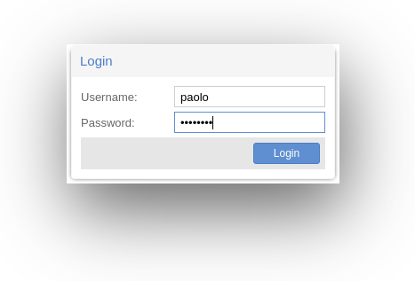
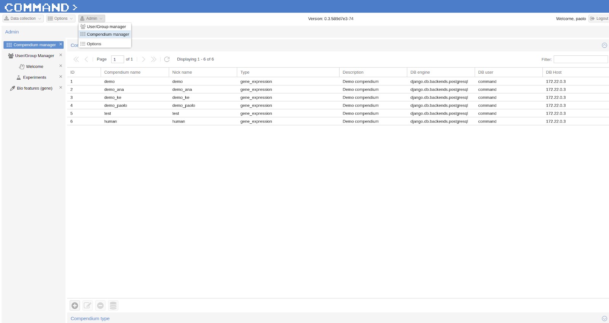
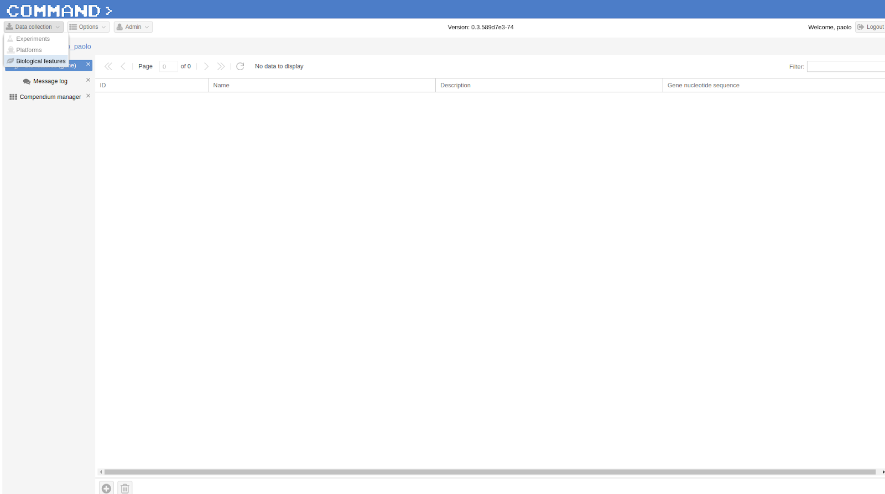
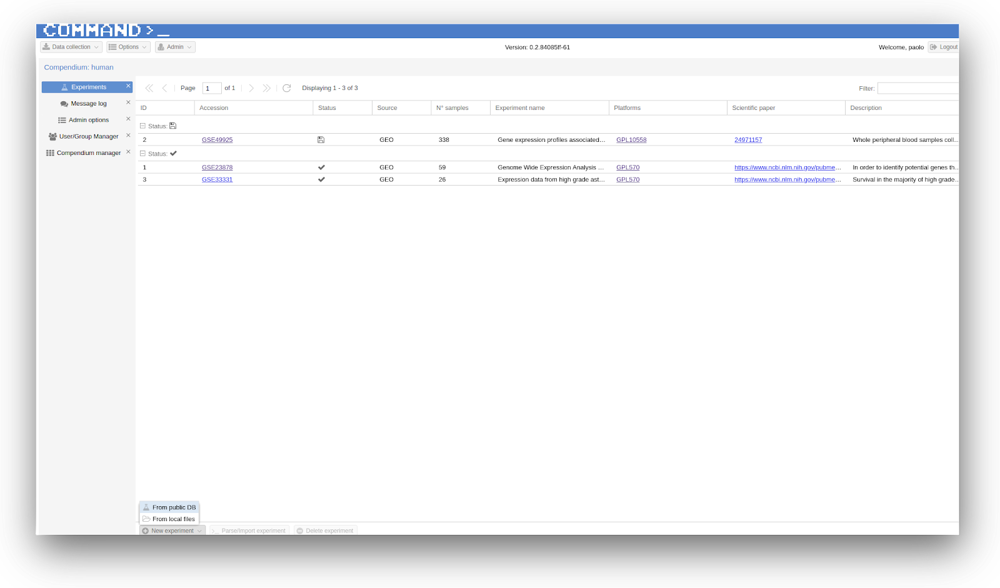
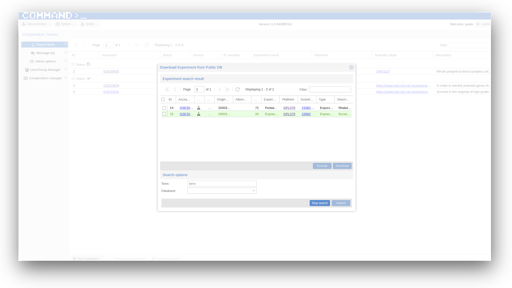

Getting start with COMMAND>_
============================

Getting my user id and password
-------------------------------

If you are using the public COMMAND>_ instance on https://command.fmach.it:4242 you can login using:

   - username: ``guest``
   - password: ``demo``

This is a user with restricted privileges meant for demonstration purpose only. If you have your running instance of COMMAND>_ (see :doc:`deploy`) you will be able to first login using:

   - username: ``admin``
   - password: ``admin``

Now you can change the admin password, create new users and assign them privileges following the instructions in :doc:`admin_user`.

.. _login:

Set up and select a compendium
------------------------------

The first thing to do is creating a new empty compendium. Go to Admin (top bar) > Compendium Manager > Create Compendium (bottom-left corner + icon) and follow the instructions at :doc:`admin_user`.

.. _comp01:

Now that a new compendium has been set up you need to retrieve a FASTA file containing the gene ids and sequences for the species you want to study.

.. Tip::
	For example you can visit the `NCBI Nucleotide database <https://www.ncbi.nlm.nih.gov/nucleotide/>`_ and get the coding sequences for the organism of interest. This file is mandatory for blasting and mapping respectively in either microarray or RNA-Seq experiments. In order to import it into COMMAND>_ go to Data collection (on the top-left corner) > Biological features, then select Import biological features from the bottom-left + icon.

.. _comp02:

Now your gene annotation file has been imported and you can start looking for interesting experiments (both microarray and RNA-Seq) related to the organism of interest.

.. _search_database:

Searching public databases
--------------------------

After a new empty compendium has been created and a species of interest selected the user can start looking for collections of samples (from one or more experiments) from public databases (GEO, ArrayExpress or, in case of RNA-Seq experiments, SRA):
Go to > Data collection (on the top-left corner) then > Experiments > New Experiment (on the bottom right corner) > from public DB.

.. _search01:

- In the Search options field of the dialog 'Download from Public DB' select the DB (here GEO) and the term of interest, either a description (e.g. Leukemia b-cell, Vitis vinifera, erc.) or directly a GSE ID.
- From the list select an experiment of interest and click the download button.

.. Tip::
	You can download multiple experiments at the same time.

.. _search02:

- After a while, depending of the number of samples in the selected experiment(s) you have your experiment downloaded.

.. Tip::
	- Check Message log frequently.
	- Inspect the Experiments section to see which experiments are available, yet to be parsed or already imported.

Now you can start parse and import some experiment (see :doc:`use_cases`).

