Use Cases
=========

In this section we show how to both parse and import experiments from various gene expression  platforms, technologies and sources (both public databases and local files) using the provided default scripts.

Use Case - Affymetrix from GEO
------------------------------

Import Gene Annotations
+++++++++++++++++++++++

We want to look for experiments related to Yeast: the `Saccharomyces Genome Database <https://www.yeastgenome.org/>`_ is the proper choice for retrieving sequences associated to Yeast’s genes (from `this <https://downloads.yeastgenome.org/sequence/S288C_reference/orf_dna/orf_coding_all.fasta.gz>`_ link). 
Go to > Data collection (on the top left corner) then > Biological features > Import biological feature (+ symbol on the bottom left) > Type: FASTA , File name: select the annotation file you downloaded before > Import Biological features. Wait.

.. _Case01_00:
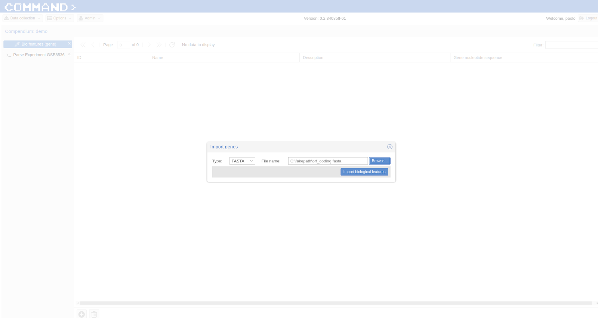

.. _Case01_01:
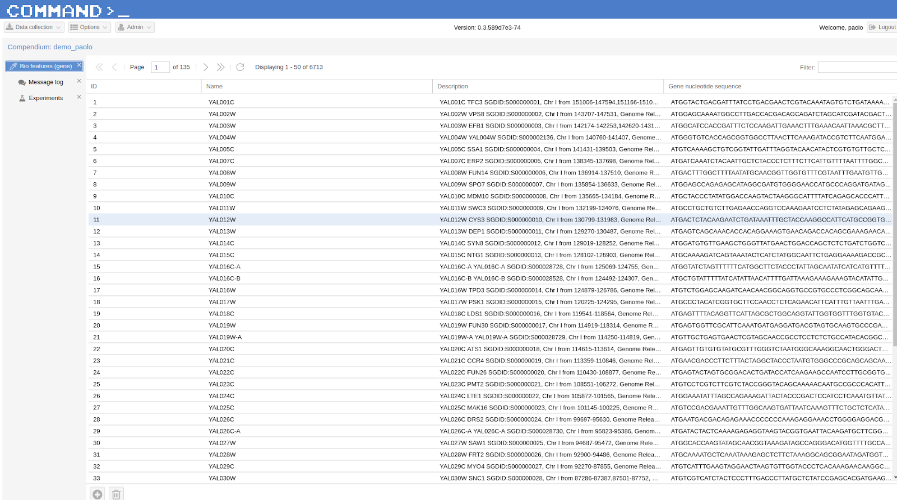

We start by selecting Experiments from Data collection (top left corner) then we highlight the experiment of interest (it was previously retrieved from GEO following :ref:`search_database`), here `GSE8536 <https://www.ncbi.nlm.nih.gov/geo/query/acc.cgi?acc=GSE8536>`_, an expression analyses study which inspects  the response of Saccharomyces cerevisiae to stress throughout a 15-day wine fermentation.

Parse Experiment, Platform and Samples
++++++++++++++++++++++++++++++++++++++

Since we have a new platform (`GPL90 <https://www.ncbi.nlm.nih.gov/geo/query/acc.cgi?acc=GPL90>`_) never imported before into COMMAND>_ for this compendium,  we retrieve the sequences associated to the Affymetrix probe ids (:download:`YG_S98 probes <YG_S98.probe_tab>`) for this platform from the `Affymetrix Support sitewebsite <http://www.affymetrix.com/support/technical/byproduct.affx?product=yeast>`_. 

From Experiments (Data collection Menu) we highlight the selected experiment (GSE8536 here) and click the Parse/Import experiment from the bottom bar.
On the main window you can see that the Experiment tab is populated with metadata gathered from the publicDB (GEO here).
Now we can start parsing the Experiment, the Platform(s) and the Samples.

.. _Case01_02:
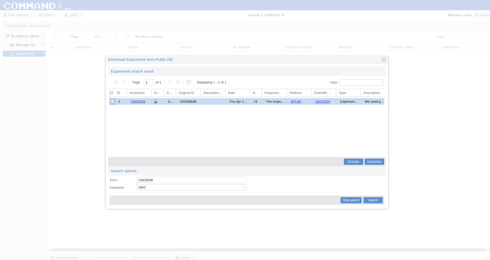

.. _Case01_03:
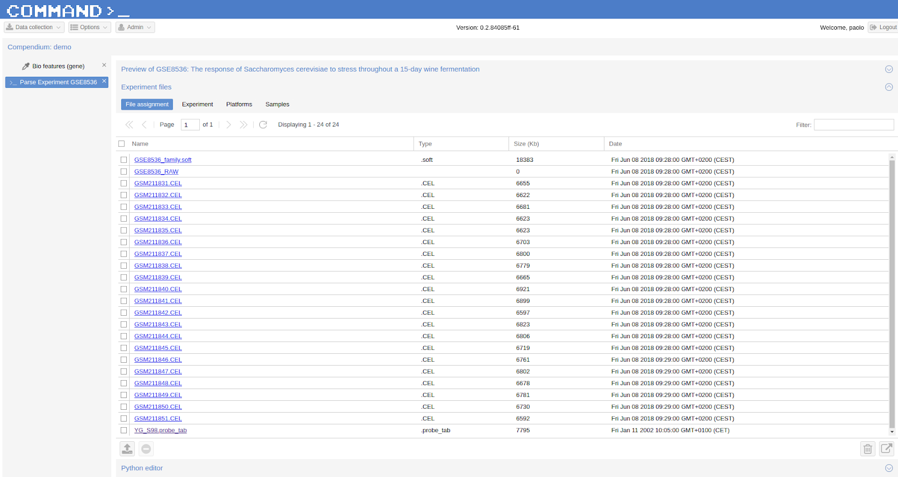

Being a dataset retrieved from GEO we take advantage of the .soft file downloaded (see GEO Documentation for a description of this type of file):

Select `GSE8536_family.soft` and click the `Use assignment script to assign files to experiment entities` icon on the bottom-right. A dialog will show-up:

- Script > assign_all.py > Only selected files
- Experiment tab > Script: > soft_experiment.py, Execution order: 1
- Platform tab > Script: > soft_platform.py, Execution order: 1
- Sample tab > Script: > soft_sample.py, Execution order: 1
- Run assignment script

.. _Case01_03b:
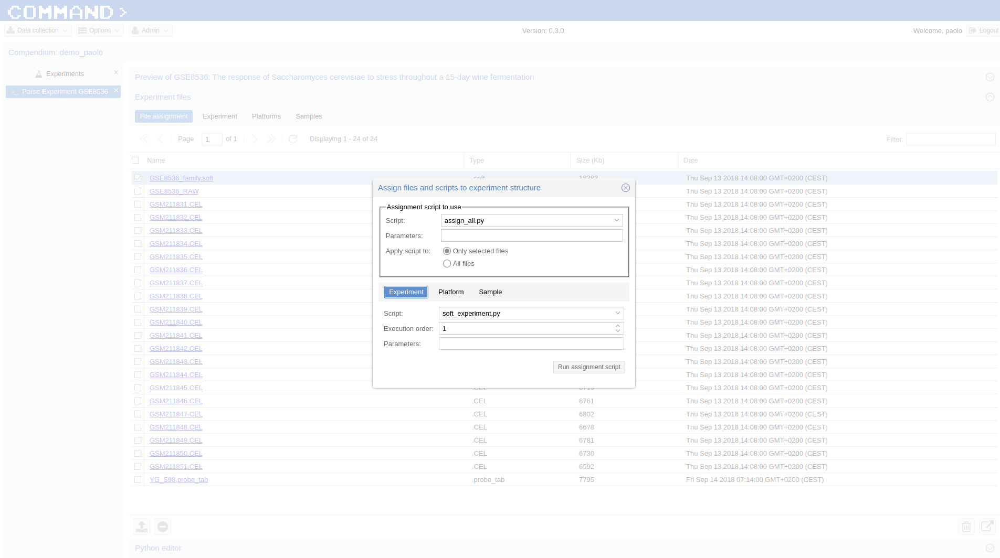

Now in order to parse the new platform we are going to use the sequences associated to the Affymetrix probe ids we have already downloaded. We import the annotation ( :download:`YG_S98 probes <YG_S98.probe_tab>` ) in the `File assignment` section of `Experiment files` clicking the upload icon on the bottom of the page. 

Now we associate the file to the platform:

- In Experiment files Section > File Assignment select the uploaded file (YG_S98.probe_tab) and click `Use assignment script to assign files to experiment entities`. On the Assign files dialog:

- Script: assign_all.py
- Param: 
- Only selected files checked  (default)
- Platform tab > Script: `gpr_platform.py` , Parameters: 0,Probe X|Probe Y,Probe Sequence , Execution order: 2
- Run assignment script

.. _Case01_03c:
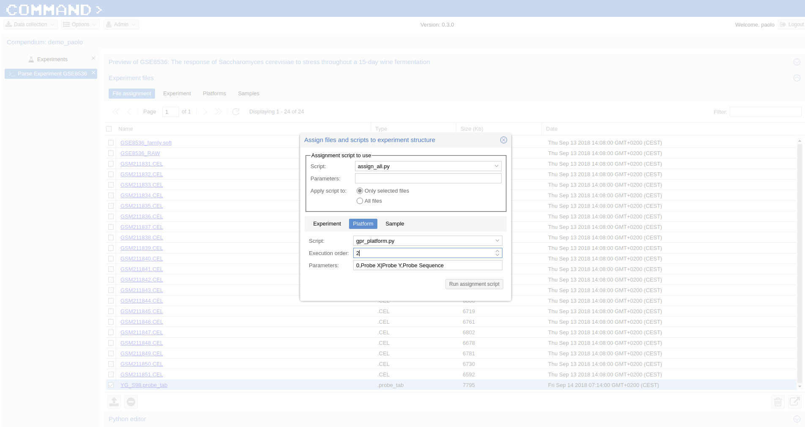

.. Note::
  
  - the Parameters assigned to the `gpr_platform.py` script specify to not skip any line, use the combination of Probe X and Probe Y columns to create an unique id for the cel files and indicate the sequences for the probes are in the Probe Sequence column.
  - The parsing of the Platform is a once time procedure: from now on we can use this platform for all related experiments.

Now we parse the Affymetrix cel files (sample files):

- In Experiment files Section > File Assignment  we use CEL as filter and select all files > click the `Use assignment script to assign files to experiment entities` icon on the bottom-right corner and the Assign files and scripts to experiment structure dialog will pop-up:
- Script > match_entity_name.py 
- Only selected files (default) checked
- Sample tab > Script: `cell_sample.py`, Execution order: 2
- Run assignment script

.. _Case01_03d:
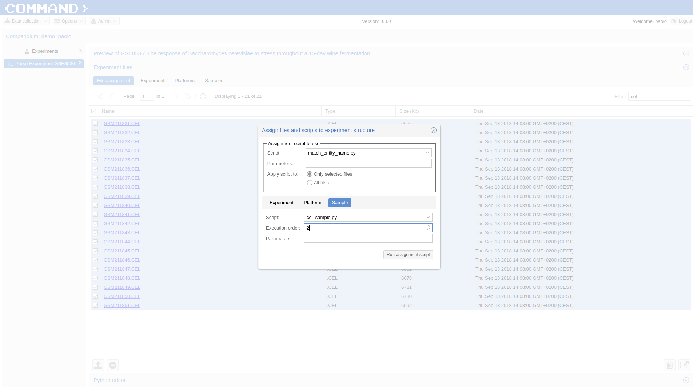

Finally, in the Preview Section (`Preview of GSE8536` here) click Run Selected (bottom-right corner). After a while  your samples will be parsed.

Now you can Import both the Platform (since is the first time we use this specific one) and the Experiment.

.. Tip::
   Check that both the platform and the samples are properly parsed from the Preview interface of the Parse Experiment section clicking on the platform and on each sample.

Click the Import button on the bottom-right corner and select Import whole experiment. After a while the experiment and the platform (in this case) will be imported.

.. _Case01_04:
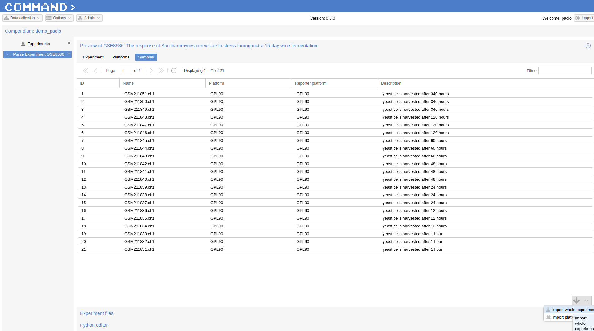

Use Case - Nimblegen from ArrayExpress
--------------------------------------

In COMMAND>_ the preferred  way to import experiments from public db is by using GEO which provide the most convenient interface out-of-the-box. In case an experiment is not included in GEO it is possible to import it from ArrayExpress. Start by searching the experiment of interest following the procedure described in :ref:`search_database`, select `E-EGEOD-58806 <https://www.ebi.ac.uk/arrayexpress/experiments/E-GEOD-58806/>`_ as Term and ArrayExpress as Database. Go the experiment slide on the left, select the experiment of interest (here `E-EGEOD-58806 <https://www.ebi.ac.uk/arrayexpress/experiments/E-GEOD-58806/>`_ ) and click >_ Parse/Import experiment.
On the main window you can see that the Experiment tab is populated with metadata gathered from the publicDB (ArrayExpress here).

Import Platform from GEO
++++++++++++++++++++++++

COMMAND>_can use a previous imported platform from a different public database (either from ArrayExpress or GEO)  and assign it as Reporter platform (in the preview main section of Parsing) for the current experiment. 
In our case we want to parse and import an experiment from ArrayExpress using the previously imported platform from GEO.
In order to do so we import the platform only for another experiment (here `GSE32561 <https://www.ncbi.nlm.nih.gov/geo/query/acc.cgi?acc=GSE32561>`_) which uses the same platform of the experiment of interest.
After the selection of the new experiment using the Searching from public db procedure we use the Nimblegen ndf files which allows to associate probes to sequences to the platform GPL14649.

- Experiment files  > File Assignment > Select GPL14649_071112_Ecoli_K12_EXP.ndf and in the  Assign files dialog:
- Script: match_entity_type_param.py
- Param: platform
- Only selected files checked  (default)
- Platform tab > Script: > gpr_platform.py;  Parameters: 0,X|Y,PROBE_ID; Execution order: 2
- Run assignment script

.. _Case02_04:
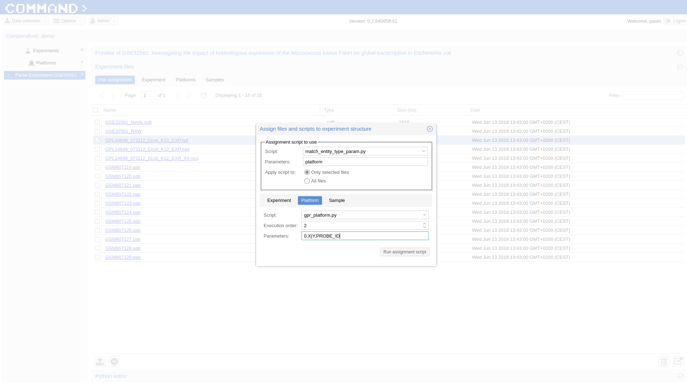

.. _Case02_05:
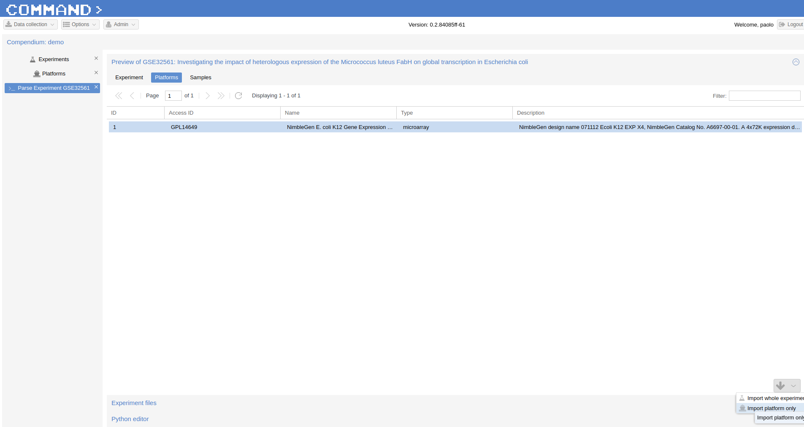

Now we can import the platform only from the Platform section of Preview:

Parse Experiment, Platform and Samples
++++++++++++++++++++++++++++++++++++++

Now the Platform is available and can be used to import the experiment retrieved from ArrayExpress.
- Experiments >  Parse Experiment EGEOD-58806 > Experiment Files > Platform and now click over A-GEOD-14649 in the Reporer Platform field and selected the previously imported GPL14649.

In order to parse the nimblegen .pair files:
- In Experiment files Section > File Assignment > Filter .pair and select all  files
- click the 'Use assignment script to assign files to experiment entities' icon on the bottom-right and the Assign files and scripts to experiment structure dialog will pop-up:
- Script > `match_sample_name.py` > Only selected files
- Sample > Script: > `pair_sample.py`, Execution order: 2
- > Run assignment script

Use Case - Multiplatform Experiment
-----------------------------------

It is standard practice for gene expressione esperiments to make use of multiple platforms for the same organism in the same experiment: usually it comes from multiple single experiments performed in different conditions/time. Here, we select from GEO the `GSE13713 <https://www.ncbi.nlm.nih.gov/geo/query/acc.cgi?acc=GSE13713>`_ experiment regarding Phenotypic and transcriptomic analyses of mildly and severely salt-stressed Bacillus cereus ATCC. It is related to two platforms: `GPL7634 <https://www.ncbi.nlm.nih.gov/geo/query/acc.cgi?acc=GPL7634>`_ and `GPL7636 <https://www.ncbi.nlm.nih.gov/geo/query/acc.cgi?acc=GSE7636>`_.

Import Gene Annotation
++++++++++++++++++++++

Since the platforms related to the selected experiment were never imported before into  COMMAND>_, we need the gene sequences in order to properly import our probes at gene level. We got gene/sequence list from ncbi: go `here <https://www.ncbi.nlm.nih.gov/nuccore/AP007209.1>`_ and from the top-right button select send to: Coding sequences, Format: FASTA Nucleotide and Choose destination: File. 
In COMMAND>_ go to > Data Collection (on the top left corner) then > Bio features (genes) > Import biological feature (+ symbol on the bottom left) > Type: FASTA , File name: select the annotation file you downloaded before > Import Biological features.

Parse Platforms and Samples
+++++++++++++++++++++++++++

In order to parse the two platforms, we need both the soft file related to the experiment and the soft_platform.py script. 

In Experiment files Section > File Assignement > Select the GSE13713_family.soft file and on the Assign files dialog:

- Script: `match_all.py`
- Param: platform
- Only selected files checked
- Platform tab > Script: > `soft_platform.py`, parameters: True, Execution order: 1

In Experiment files Section > File Assignement > Select the .txt files (all Sultana in the Filter field) and on the Assign files dialog:

- Script: `match_entitye_name.py`
- Parameters: ch1
- Only selected files checked

Platform tab > Script: > `gpr_sample.py`; parameters: Gene name,Spot Mean Intensity (Cyanine5_060909_1136(1)),0; Execution; order: 2

DO the same again for the ch2 but use as Parameters for Platform:

Platform tab > Script: > `gpr_sample.py`; parameters: Gene name,Spot Mean Intensity (Cyanine3_060909_1136(1)),0; Execution; order: 2

for GPL10439:

- In Experiment files Section > File Assignement > Select the .ndf file and on the Assign files dialog":

    - Script: `match_entity_type_param.py`
    - Param: platform
    - Only selected files checked
    - Platform tab > Script: > `soft_platform.py`, Execution order: 2

- In Experiment files Section > File Assignement > Select the .txt files (all pair files) and on the Assign files dialog:

    - Script: `match_entity_name.py`

- Parameters: ch1

    - Only selected files checked
    - Platform tab > Script: > `gpr_sample.py`; Execution; order: 2
    - Parameters: ID_REF,Spot Mean Intensity (Alexa555_101810_0935(1)),0

- Parameters: ch2

    - Only selected files checked
    - Platform tab > Script: > `gpr_sample.py`; Execution; order: 2
    - Parameters: ID_REF,Spot Mean Intensity (Alexa647_111510_1227(1))

Use Case - Import experiment from local file
--------------------------------------------

In order to import an experiment which is not available from public repositories the user needs to provide:

- a yaml file containing the descritption of the experiment to be imported;
- a data matrix with the first row containing the sample names, the first columns containing the gene_ids and the rest of the columns containing raw gene expression values one for each sample.

Use Case - RNA-Seq
------------------

Similarly to the microarray case, RNA-Seq experiments can be retrieved from public database, specifically the `Sequence Read Archive (SRA) <https://www.ncbi.nlm.nih.gov/sra>`_ , from the New Experiment/From public DB interface (bottom-left border icon). 
Here we select a small RNA-Seq experiment from SRA (`PRJNA471071 <https://www.ncbi.nlm.nih.gov/bioproject/PRJNA471071>`_) where the authors employed a computational model of underground metabolism and laboratory evolution experiments to examine the role of enzyme promiscuity in the acquisition and optimization of growth on predicted non-native substrates in E. coli K-12 MG1655. 

.. _CaseRNASeq_01:
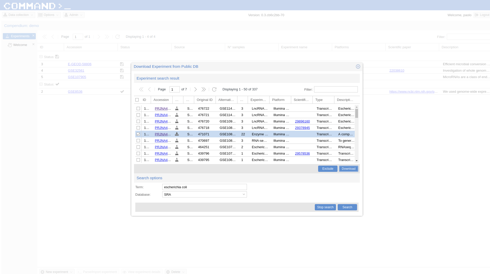

Indexing
++++++++

The first step is to build the index for the quasi-alignment mapper (`kallisto <https://pachterlab.github.io/kallisto/>`_ here [#f1]_):
select `demo.fasta`, It contains the sequences for the genes of the Escherichia coli genome and it is automatically build by COMMAND>_ when you begin parsing the data.

Use Assignment Script (bottom-right corner icon) > from the dialog:`match_entity_name.py` > Only selected files
Experiment tab > Script: > `kallisto_index.py`, Execution order: 1 > Run assignment script

RNA-Seq pre-processing and summarization
++++++++++++++++++++++++++++++++++++++++

Since the experiment is paired-end, the default script for preprocessing and summarization requires to indicate only one of the two paired files. 
You can do it using the filter and selecting `*1.fastq`, the script will take care of the rest.

Use Assignment Script (bottom-right corner icon) > from the dialog:`match_entity_name.py` > Only selected files
Experiment tab > Script: > `trim_quantify.py`, Execution order: 1, Parameters: 1 (being a paired end)

.. _CaseRNASeq_05:
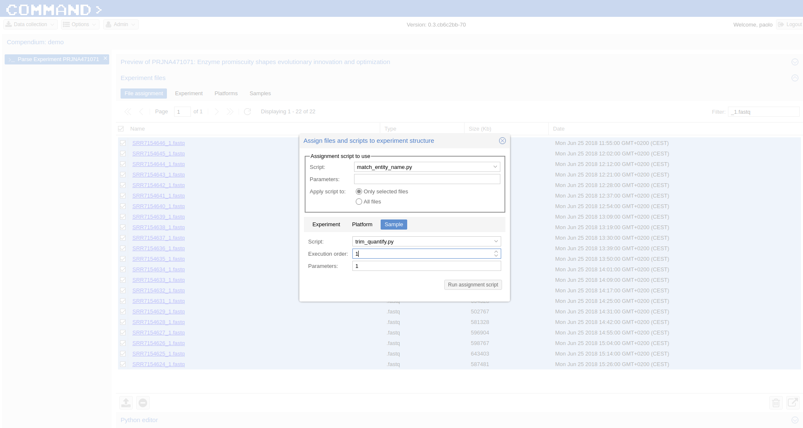

Run assignment script
+++++++++++++++++++++

After a while all the sample will be preprocessed and summarized and the experiment can be imported from the Preview section: bottom-right corner > Import whole experiment.

Mapping probes and export the gene expression matrix
====================================================

If you are done with importing experiments you can now map the probes to genes using BLAST [#f2]_ and a double filtering GUI of COMMAND>_.
Go to Platform, select the platform to be mapped (e.g. GPL90 from the Affymetrix Use Case) and click the chain icon (map platform to biological features) on the bottom left corner.

Now you can use the dialog to run BLAST and filter the data (here we use the default settings).

When your are fine with filtering you can use one of the selected filtered objects and download the expression matrix going to Options > Export.

.. _MapProbes_01:
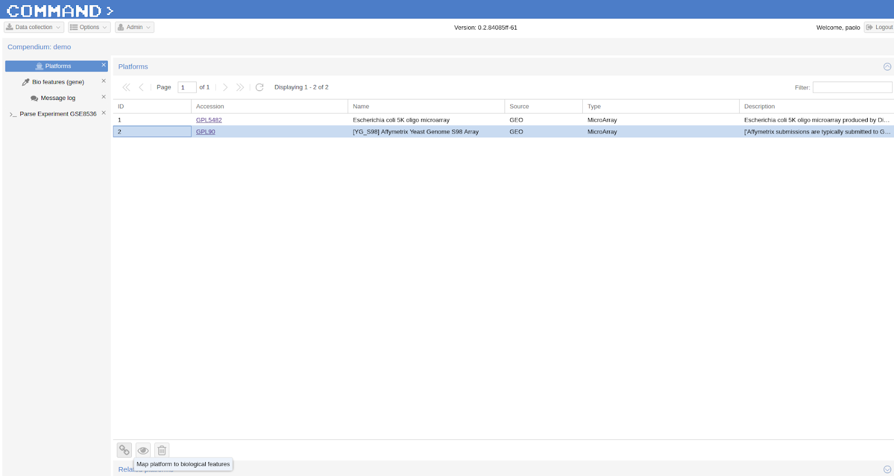

.. _MapProbes_02:
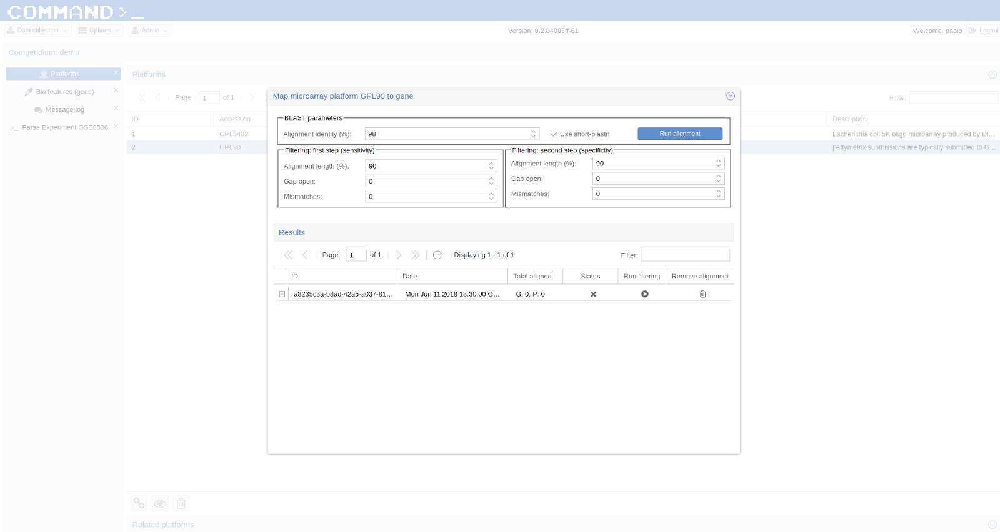

.. Tip::
   You can filter the data with different parameters, each set of parameters is saved in a specific slot.

.. rubric:: References

.. [#f1] Nicolas L Bray, Harold Pimentel, Páll Melsted and Lior Pachter, Near-optimal probabilistic RNA-seq quantification, Nature Biotechnology 34, 525–527 (2016), doi:10.1038/nbt.3519
.. [#f2] Altschul, S.F., Gish, W., Miller, W., Myers, E.W. & Lipman, D.J. (1990) "Basic local alignment search tool." J. Mol. Biol. 215:403-410.